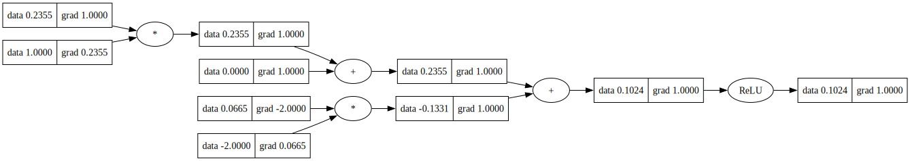

# Deep Autograd

A tiny scalar-valued autograd engine with a small PyTorch-like neural network library on top.

## Installation

```bash
pip install deep_autograd
```

---

## Usage

- Checkout usage in [demo.ipynb](./notebooks/demo.ipynb)
- and, in [trace_graph.ipynb](./notebooks/trace_graph.ipynb)



---

## Development

- To setup project:

```bash
make setup
```

---

## Tests

- To run tests:

```bash
pytest
```

---

## License

[MIT](./LICENSE)

---

## Credits

- [Andrej Karpathy](https://github.com/karpathy)
